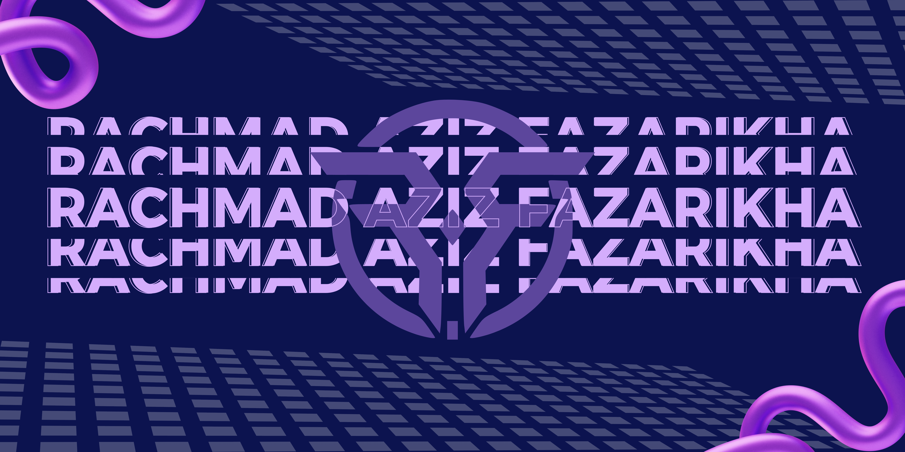

  

###

Rachmad Aziz Fazarikha is a passionate junior web developer and a dedicated undergraduate student in Information Systems at Universitas Trunojoyo Madura. With a focus on full-stack development, he leverages modern frameworks to streamline and enhance his projects, delivering efficient and impactful solutions.

###

  
  
  
  
  
  
  
  
  
  
  
  
  
  
  
  
  
  
  
  
  

###

  
  
  
  
  
  

###

  
  
  

###

###
