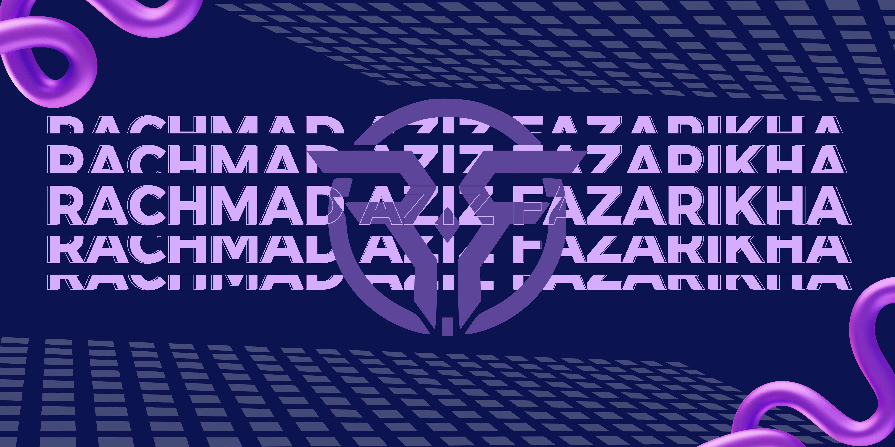

<div align="center">
  
</div>

<h1 align="center">Halo, saya Rakha 👋</h1>

<div align="center">
  <a href="https://git.io/typing-svg">
    
  </a>
</div>

###

<p align="center">Mahasiswa Sistem Informasi Universitas Trunojoyo Madura yang antusias di dunia web development. Fokus pada full-stack development dengan framework modern — Laravel, Next.js, dan Tailwind — untuk membangun solusi yang efisien dan berdampak.</p>

###

## ⚡ Tentang Saya

```yaml
name: Rachmad Aziz Fazarikha
location: Madura, Indonesia 🇮🇩
education: Sistem Informasi, Universitas Trunojoyo Madura
focus: Full-Stack Web Development
currently_building: [ERP PAKD, ASNAI EdTech Platform]
learning: [Docker, RAG & AI Integration, Livewire]
fun_fact: "Konversi PDF jadi audiobook iseng-iseng 📚→🎧"
```

###

## 🛠️ Tech Stack

<div align="center">
  
  
  
  
  
  
  
  
  
  
  
  
  
  
  
  
  
  
  
  
  
  
  
</div>

###

## 📊 Skill Progress

<div align="center">


</div>

###

## 🚀 Sedang Dikerjakan

<div align="center">

| Project | Deskripsi | Stack |
|---------|-----------|-------|
| [erp-pakd](https://github.com/Pak-D-Kingdom/erp-pakd) | Sistem ERP perusahaan (HRD, Payroll, Approval Workflow) | Laravel · Filament · PostgreSQL |
| [NewElearning](https://github.com/RAFazarikha/NewElearning) | Platform EdTech CPNS "ASNAI" dengan AI Question Generator | Laravel · Next.js · Docker |
| [pdf-to-audiobook](https://github.com/RAFazarikha/pdf-to-audiobook) | Konversi PDF menjadi audiobook | Python |
| [scrapping-app](https://github.com/RAFazarikha/scrapping-app) | Aplikasi web scraping | Python |

</div>

###

## 📈 GitHub Stats

<div align="center">
  
  
</div>

###

<div align="center">
  
  
</div>

###

## 🏆 GitHub Trophies

<div align="center">
  
</div>

###

## 🐍 Contribution Graph

<picture>
  <source media="(prefers-color-scheme: dark)" srcset="https://raw.githubusercontent.com/RAFazarikha/RAFazarikha/output/github-snake-dark.svg" />
  <source media="(prefers-color-scheme: light)" srcset="https://raw.githubusercontent.com/RAFazarikha/RAFazarikha/output/github-snake.svg" />
  
</picture>

###

<div align="center">
  
</div>

###

## 🌐 Temukan Saya

<div align="center">
  <a href="https://instagram.com/fzrkha" target="_blank">
    
  </a>
  <a href="https://linkedin.com/in/rachmad-aziz-fazarikha-9a44b8295/" target="_blank">
    
  </a>
  <a href="https://discord.gg/rUrJV8B9" target="_blank">
    
  </a>
  <a href="mailto:fazarikha923@gmail.com" target="_blank">
    
  </a>
  <a href="https://www.facebook.com/rachmad.fazarikha.3?locale=id_ID" target="_blank">
    
  </a>
  <a href="https://api.whatsapp.com/send/?phone=6282143456658&text&type=phone_number&app_absent=0" target="_blank">
    
  </a>
</div>
